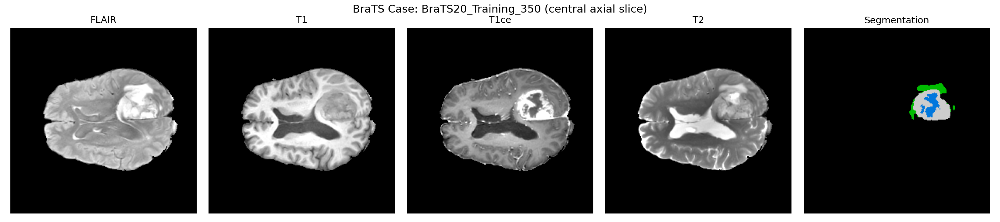
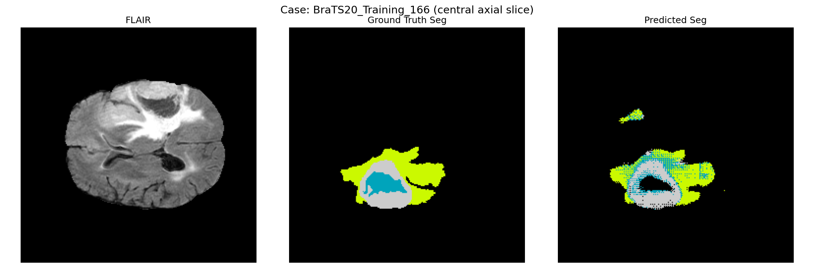
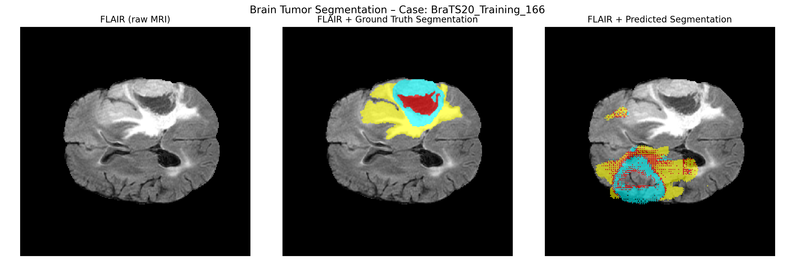

# 🧠 Brain Tumor MRI: Multimodal Segmentation + Outcome Prediction  
*BraTS2020 • 3D U-Net • Radiomics • Clinical ML Model*

---

## 📌 1. Introduction

This repository implements a complete **end-to-end medical imaging and clinical outcome prediction pipeline** for brain tumor analysis using the **BraTS2020** dataset.  
It demonstrates the full workflow expected in biomedical AI roles, including:

- Multimodal **3D MRI preprocessing** (T1, T1CE, T2, FLAIR)
- **3D U-Net tumor segmentation** using PyTorch + MONAI
- **Radiomic feature engineering** (tumor subregion volumes, ratios)
- Integration of **clinical metadata** (age, resection status)
- **1-year survival risk prediction** using machine learning

This mimics workflows used in real-world research groups (e.g., UTSW, MD Anderson, Mayo Clinic).

---

## 🎯 2. Problem Statement

Gliomas are aggressive tumors with diverse imaging characteristics.  
Clinicians rely on MRI, but:

1. Tumor boundaries are difficult and time-consuming to segment  
2. Tumor geometry correlates strongly with **patient prognosis**  
3. Combining imaging + clinical features improves risk assessment  

This project builds a system that:

> **Segments brain tumors from MRI and predicts whether a patient is high-risk (<1-year survival).**

---

## 🧩 3. Dataset

**BraTS2020 (Brain Tumor Segmentation Challenge)**  
Modalities:

- T1  
- T1CE  
- T2  
- FLAIR  

Labels:

| Label | Meaning                              |
|-------|--------------------------------------|
| 0     | Background                           |
| 1     | Necrotic / Non-enhancing core        |
| 2     | Edema                                |
| 4 → 3 | Enhancing tumor (mapped to class 3)  |

Clinical metadata includes:

- Age  
- Extent of Resection (GTR, STR, NA)  
- Survival days  

---

## 🧱 4. Pipeline Overview

### **1️⃣ Preprocessing & Splits**

- NIfTI loading with **nibabel**
- Spatial normalization to **RAS orientation**
- Intensity normalization  
- Patch-based sampling for training  
- Automatic train/validation CSV generation  
- Visualization utilities for QC  

---

## 🧩 Ground Truth Visualization

A central axial slice from a BraTS case showing the MRI and **ground-truth tumor annotation**.

  

---

## 🧠 5. 3D Tumor Segmentation (U-Net)

**Model:**  
- **3D U-Net** with 4-channel MRI input  
- Loss: **Dice + Cross Entropy**  
- Training: patch-based sampling  
- Inference: sliding window  

**Results (2 CPU epochs — sanity check):**  
- **Validation Dice ≈ 0.38**  
*(Significantly higher when trained on GPU.)*

Outputs include:

- **Predicted `.nii.gz` masks**
- **PNG visualizations**

---

## 🎯 Model Prediction (Single Slice)

  

---

## 📊 6. Radiomics Feature Extraction

For each case we compute:

- Subregion voxel counts & volumes  
- Whole tumor volume  
- Ratios:
  - core / whole  
  - edema / whole  

Saved to:  
`data/processed/brats_radiomics_gt.csv`

These radiomic features power the outcome model.

---

## 🧬 7. Outcome Prediction Model

Dataset:  
`data/processed/brats_outcome_dataset.csv`

**Target label:**  
High-risk (< 365 survival days)

⚠️ **Survival_days was NOT used as a feature** to prevent label leakage.

**Model:**  
- RandomForestClassifier  
- One-hot encoding of categorical clinical fields  
- Stratified train/test split  

### ✔ **Evaluation (Held-out Test Set)**

| Metric            | Score |
|-------------------|-------|
| **Accuracy**      | 0.611 |
| **ROC AUC**       | 0.741 |
| **High-Risk Recall** | 0.765 |

**Interpretation:**  
Radiomic morphology + minimal clinical features provide meaningful prognostic signal, consistent with classical radiomics studies.

---

## 🧠 Segmentation Comparison (Before → Ground Truth → Prediction)

  

---

## 🛠️ 8. Tech Stack

- **Python**
- **PyTorch**, **MONAI** (medical imaging DL)
- **Nibabel** (NIfTI I/O)
- **scikit-learn** (outcome model)
- **pandas / NumPy**
- **joblib** (model persistence)

---

## 🚀 9. Future Work

- Train longer with GPU to improve Dice  
- Use *predicted* masks instead of GT for outcome model  
- Add SHAP / LIME explanations for feature importance  
- Train survival models (Cox, DeepSurv)  
- Add model uncertainty estimation  
- Evaluate calibration & prognosis confidence  

---

## 👨‍⚕️ 10. Clinical Relevance

This pipeline shows how:

- MRI-derived morphology  
- Radiomic features  
- Minimal clinical inputs  

can **support personalized prognosis** for glioma patients.  
This is the foundation for real-world clinical decision-support systems.

---

## 📚 Citation

If you use this code, please cite:

**BraTS Dataset:**  
> Menze et al., "The Multimodal Brain Tumor Image Segmentation Benchmark (BRATS)", IEEE TMI, 2015.  
> Bakas et al., "Advancing The Cancer Genome Atlas Glioma MRI collections", Sci Data, 2017.

**MONAI:**  
> MONAI Consortium, "MONAI: An Open-Source Framework for Deep Learning in Healthcare", arXiv, 2020.

---

## ⭐ Author
Somesh Panchal

